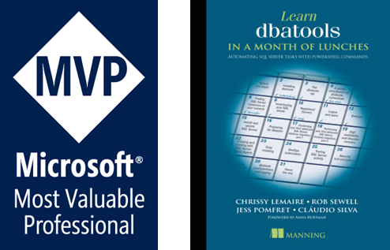

# Writing T-SQL code for the engine, not for you! - The training day

---

---

# Scope

The idea for today is for each scenario:

* Find/understand the process (normally a query)
* Analyze the performance
* Rewrite T-SQL

# Out of scope

We won't be talking about:

* Columnstore
* In-Memory
* Others

---

# Before we go further - Setting expectations

<!--
    1. Not one-size-fits-all! Lots of variables can change the behaviors (From Hardware to settings CTfP, MaxDop, MaxMemory, edition, and the list goes on)
    
    2. The idea is to provide you with different perspectives on problems/solutions.
    To show you how different settings influence different behaviors.
    If you need to work with different instances, you know that rarely are exactly the same.
    Even a product will be different depending on the way a client is using it (think on the data distribution)

    3. The tools I will be using aren't the only ones that exist out there. Maybe you can have monitor tools like, I also use them on some clients, they can be awesome! Leverage on them.

    4. This doesn't end here. If you are in IT you should acknowledge that you have decided to study for the rest of your career, otherwise you will lose the train and sit on the tech-debt.
    Spin a local instance, test, change, test again, repeat.
-->

* No silver bullets! 🤷🏽‍♀️ Not one size-fits-all
  * There are too many variables influencing things.

  * Some suggestions work in some cases. In others may not work so well.

* It's my approach. My experience. Based on real-life scenarios.

* There are other ways/tools to accomplish the same. Keep your mind open to learn different ways.

* Go back home/work and test/experiment (non-prod only, please! 😅)

---

# Before we go further - Real-life experience

<!--
  Maybe isn't yet the time for you where a few milliseconds will make a difference. However, i

  Some examples we going to see will show small but good enough improvements to understand the differences.
  No one wants a query running for 10 minutes, right?
-->

* These scenarios look too extreme - believe me, they aren't 😏
  * "But of course the table will have a supportive index" - Think again.
  * "Who puts hundreds or even thousands of values within a `IN()` clause?" - I have news for you...

* If we are aware of what exists, in the near future, if you need it, it will be easier to approach it.

---

# Who am I?
Cláudio Silva (He / Him)

### What do I do?
 
- Performance Tuning
- Automation

Open-Source Contributor
- dbatools
- dbachecks 

---

# Agenda

09:00 – 10:00: Introduction / Tools

10:00 - 10:30: Let's see some demos?

10:30 – 11:00: Break ☕🥤🍪

11:00 – 12:00: Continue demos

12:00 – 13:00: Lunch Break 🍽️🍹

13:00 – 15:00: More demos!

15:00 – 15:30: Break ☕🥤🍪

15:30 – 16:45: Do you want some more demos?

16:45 - 17:00: Wrap-up

---

# Resources

<!--
_class: titleCenter
-->

---

